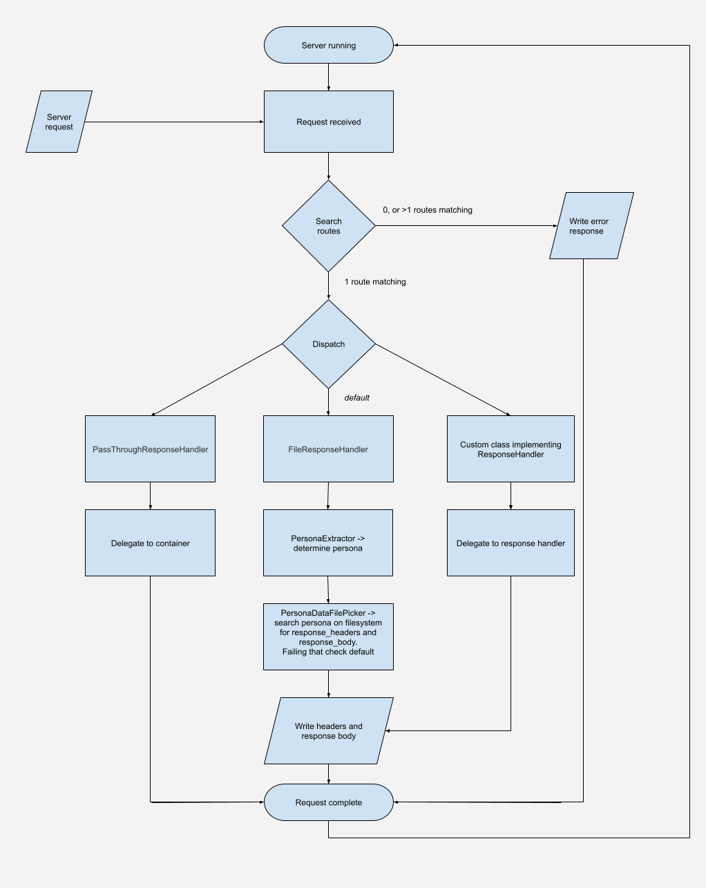

#Persona Mock Server Example Project

A sample project showing various use cases of the [Persona Mock Server](https://github.com/JohnCrossley/PersonaMockServer).

Designed to have minimal setup so comes bundled with Jetty.  But it can run on any other J2EE container.

##TL;DR;

```
# build source and download dependencies
$ mvn clean compile install

# run jetty instance on port 9090
$ mvn jetty:run &

# see some examples
$ ./examples.sh

``` 

## PMS Flowchart

